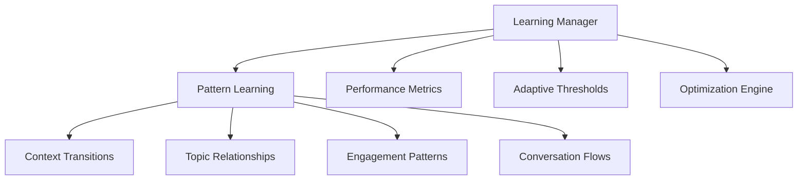
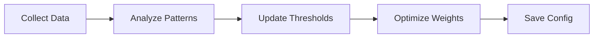

# Learning System Documentation

## Overview
The Messi Assistant implements a continuous learning system that adapts and improves through interactions. The system uses both real-time learning and periodic analysis to enhance conversation quality and context understanding.

## Core Components

### 1. Learning Manager


### 2. Data Storage
- **Learning Data** (`cache/learning/learning.json`):
  ```json
  {
      "version": "1.0",
      "exchanges": {
          "total": 0,
          "successful": 0,
          "failed": 0,
          "by_context": {}
      },
      "patterns": {
          "context_transitions": {},
          "topic_relationships": {},
          "engagement_patterns": {}
      }
  }
  ```

- **Dynamic Config** (`config/dynamic_config.yaml`):
  ```yaml
  learning:
    patterns:
      context_transitions:
        education:
          story: 0.8
          conversation: 0.6
    thresholds:
      min_response_length: 3
      context_switch_threshold: 0.7
    optimizations:
      context_weights:
        previous_context: 0.4
        current_entities: 0.3
  ```

## Learning Process

### 1. Real-time Learning
- Records each interaction
- Updates pattern recognition
- Adjusts engagement metrics
- Modifies context transitions

### 2. Periodic Analysis


### 3. Metrics Tracked
- Context accuracy
- User engagement
- Response quality
- Conversation flow
- Topic relationships

## Optimization Areas

### 1. Context Management
- Context transition weights
- Topic relationships
- Entity recognition
- Conversation flow

### 2. Response Generation
- Response length
- Engagement factors
- Topic coherence
- Follow-up prompts

### 3. Conversation Flow
- Timing thresholds
- Silence detection
- Turn-taking
- Topic switching

## Implementation Details

### 1. Data Collection
```python
async def record_exchange(self, exchange_data: Dict):
    """
    Records:
    - Context transitions
    - User engagement
    - Response quality
    - Topic relationships
    """
```

### 2. Pattern Analysis
```python
def _analyze_patterns(self):
    """
    Analyzes:
    - Successful transitions
    - Topic correlations
    - Engagement patterns
    - Conversation flows
    """
```

### 3. Optimization Process
```python
async def optimize(self):
    """
    Optimizes:
    - Context weights
    - Response parameters
    - Timing thresholds
    - Topic relationships
    """
```

## Configuration

### 1. Learning Parameters
```yaml
parameters:
  learning_rate: 0.1
  decay_factor: 0.95
  update_frequency: 3600  # seconds
  min_samples: 10
```

### 2. Thresholds
```yaml
thresholds:
  min_response_length: 3
  max_silence: 5.0
  context_switch_threshold: 0.7
  engagement_threshold: 0.6
```

### Learning Toggle
The learning system can be enabled/disabled via config:

```yaml
learning:
  enabled: true  # Set to false to disable learning
```

When disabled:
- No data collection occurs
- Static configurations are used
- No pattern analysis runs
- No automatic optimizations

To re-enable learning:
1. Set `learning.enabled` to true in config
2. Restart the application
3. Previous learning data will be loaded if available

## Monitoring and Maintenance

### 1. Health Checks
- Data integrity validation
- Performance monitoring
- Error rate tracking
- Storage management

### 2. Backup and Recovery
- Periodic data backups
- Configuration versioning
- Recovery procedures
- Data validation

## Future Improvements

### 1. Planned Enhancements
- Neural network integration
- Multi-modal learning
- Sentiment analysis
- Personality adaptation

### 2. Research Areas
- Advanced pattern recognition
- Emotional intelligence
- Context prediction
- Natural language understanding

## Usage Examples

### 1. Context Learning
```python
# Example of context learning
context_score = (
    weights["previous_context"] * previous_score +
    weights["current_entities"] * entity_score +
    weights["user_engagement"] * engagement_score
)
```

### 2. Pattern Recognition
```python
# Example of pattern recognition
if context_score > thresholds["context_switch"]:
    new_context = determine_new_context(
        text, entities, patterns["transitions"]
    )
```

## Best Practices

1. Regular Monitoring
   - Check learning metrics
   - Validate improvements
   - Monitor error rates
   - Review patterns

2. Data Management
   - Regular backups
   - Data cleaning
   - Version control
   - Storage optimization

3. Performance Optimization
   - Resource usage
   - Response times
   - Memory management
   - CPU utilization 